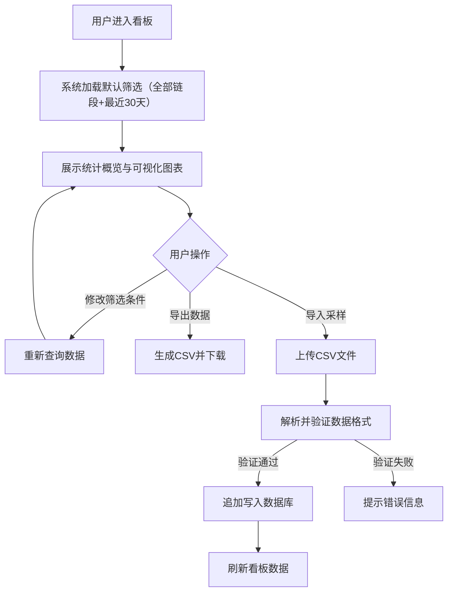

## 1. 产品概述

近海观测站浮标链节腐蚀电位与潮位差对比看板，用于海洋工程领域监测浮标节点腐蚀状态与潮位变化的关联分析。面向海洋工程师和运维人员，提供直观的数据可视化界面，支持多维度筛选、统计分析和数据导出。

- 核心价值：将腐蚀电位变化率与相邻节点潮位差进行关联分析，辅助判断海洋环境对浮标链节腐蚀的影响
- 目标用户：海洋工程运维人员、数据分析人员、科研工作者

## 2. 核心功能

### 2.1 用户角色

| 角色 | 注册方式 | 核心权限 |
|------|----------|----------|
| 普通用户 | 无需登录 | 查看看板、筛选数据、导出结果、导入采样数据 |

### 2.2 功能模块

1. **看板主页**：数据筛选区、统计概览卡、多图表可视化区
2. **数据管理**：采样记录导入、历史数据浏览
3. **节点布设**：浮标节点空间分布示意图

### 2.3 页面详情

| 页面名称 | 模块名称 | 功能描述 |
|----------|----------|----------|
| 看板主页 | 筛选控制区 | 链段下拉筛选、日期范围选择器、查询按钮 |
| 看板主页 | 统计概览卡 | 显示筛选范围内节点数、采样次数、平均变化率、最大潮位差 |
| 看板主页 | 腐蚀变化率柱状图 | 各节点日均腐蚀电位变化率对比，支持正负值展示 |
| 看板主页 | 邻节点潮位差散点图 | 同链段相邻节点同期潮位差分布，x轴为节点对，y轴为潮位差均值 |
| 看板主页 | 节点布设示意图 | 按链段展示节点相对位置，标记布设水深，支持hover查看详情 |
| 看板主页 | 数据表格 | 展示当前筛选结果的详细数据 |
| 看板主页 | 导出功能 | 将当前筛选结果导出为CSV文件 |
| 看板主页 | 导入功能 | 追加导入新的采样记录CSV文件 |

## 3. 核心流程

**主流程说明**：
1. 用户打开看板，系统默认展示全部链段最近30天的数据
2. 系统自动计算各节点腐蚀电位日均变化率和相邻节点潮位差均值
3. 用户可通过链段筛选和日期范围调整分析维度
4. 支持导出当前分析结果和导入新的采样数据

## 4. 用户界面设计

### 4.1 设计风格

**海洋科技主题**：
- 主色调：深海蓝 `#0a2463`、海洋青 `#3e92cc`
- 辅助色：警示橙 `#ff6b35`（用于负变化率）、生长绿 `#2a9d8f`（用于正变化率）
- 背景色：渐变深蓝到青色，营造深海科技感
- 卡片风格：半透明玻璃拟态（glassmorphism），带模糊背景和细边框
- 字体：显示字体使用 `Space Grotesk`，正文字体使用 `Inter`
- 图表风格：渐变色填充、柔和阴影、动画过渡

### 4.2 页面设计概述

| 页面名称 | 模块名称 | UI 元素 |
|----------|----------|----------|
| 看板主页 | 顶部导航栏 | 项目标题、系统状态指示器、导入/导出按钮 |
| 看板主页 | 筛选控制条 | 链段多选下拉框、日期范围选择器、重置/查询按钮 |
| 看板主页 | 统计卡片组 | 4张概览卡，带图标和数值，悬浮微动效 |
| 看板主页 | 主图表区 | 2x2网格布局，柱状图占上半区，散点图和布设图分占下半区左右 |
| 看板主页 | 数据表格 | 可滚动表格，支持排序，斑马纹样式 |

### 4.3 响应式设计

- **桌面端优先**：1200px+ 完整展示4张统计卡 + 2x2图表布局
- **平板端**：768px-1199px 统计卡2x2，图表单列堆叠
- **移动端**：<768px 统计卡单列，图表单列，表格横向滚动

### 4.4 交互动效

- 页面加载：卡片依次淡入（staggered animation）
- 图表加载：数据从底部渐入动画
- 卡片悬浮：轻微上浮 + 阴影加深
- 筛选变化：图表数据平滑过渡动画（ease-out, 600ms）
- 按钮交互：点击缩放反馈，边框流光效果
