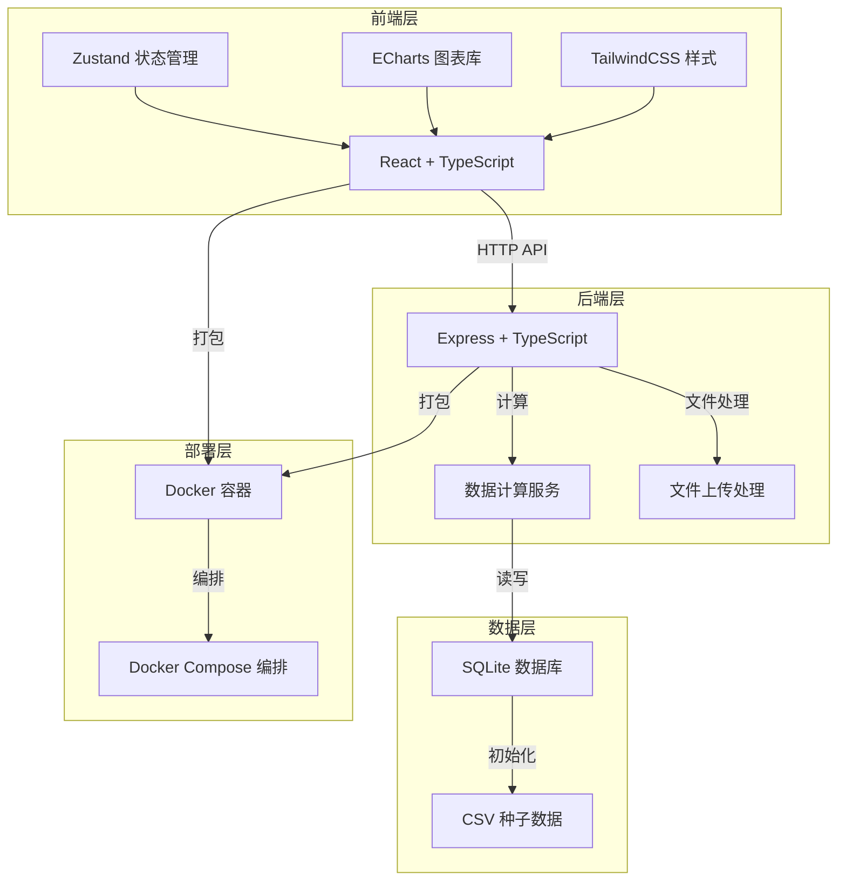
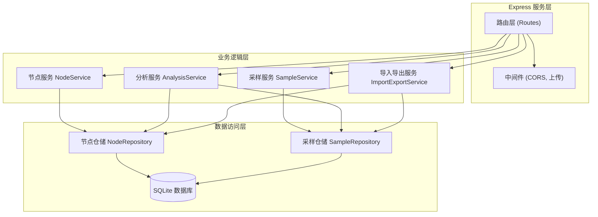
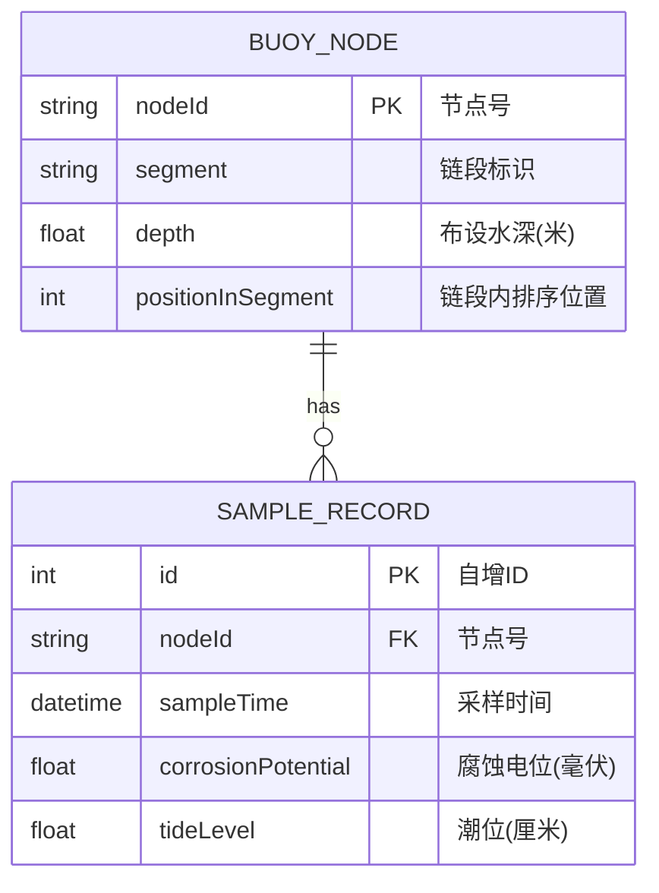

## 1. 架构设计



## 2. 技术描述

- **前端**：React@18 + TypeScript + Vite + TailwindCSS@3 + Zustand + ECharts@5 + lucide-react
- **后端**：Express@4 + TypeScript + better-sqlite3 + multer + csv-parser
- **数据库**：SQLite（嵌入式，无需额外服务，适合Docker部署）
- **部署**：Docker + Docker Compose，单容器运行前后端
- **初始化工具**：vite-init react-express-ts 模板

## 3. 路由定义

| 路由 | 用途 |
|------|------|
| / | 看板主页 |
| /api/nodes | 获取浮标节点列表 |
| /api/segments | 获取链段列表 |
| /api/samples | 采样记录CRUD，支持日期范围和链段筛选 |
| /api/analysis/corrosion-rate | 计算腐蚀电位日均变化率 |
| /api/analysis/tide-difference | 计算相邻节点潮位差均值 |
| /api/import/samples | 导入新采样记录（CSV上传） |
| /api/export/data | 导出当前筛选结果（CSV下载） |

## 4. API 定义

### TypeScript 类型定义

```typescript
// 浮标节点
interface BuoyNode {
  nodeId: string;
  segment: string;
  depth: number;
  positionInSegment: number;
}

// 采样记录
interface SampleRecord {
  id?: number;
  nodeId: string;
  sampleTime: string;
  corrosionPotential: number;
  tideLevel: number;
}

// 腐蚀变化率
interface CorrosionRate {
  nodeId: string;
  segment: string;
  avgDailyRate: number;
  sampleCount: number;
  dateRange: [string, string];
}

// 相邻节点潮位差
interface TideDifference {
  segment: string;
  nodePair: [string, string];
  avgTideDiff: number;
  sampleCount: number;
}

// 筛选参数
interface FilterParams {
  segments: string[];
  startDate: string;
  endDate: string;
}
```

### 请求/响应示例

**GET /api/analysis/corrosion-rate?segments=A,B&startDate=2024-01-01&endDate=2024-01-31**

响应：
```json
{
  "success": true,
  "data": [
    {
      "nodeId": "A01",
      "segment": "A",
      "avgDailyRate": -0.85,
      "sampleCount": 15,
      "dateRange": ["2024-01-02", "2024-01-30"]
    }
  ]
}
```

**POST /api/import/samples** (multipart/form-data)
- 字段：`file` (CSV文件)
- 响应：`{ success: true, imported: 156, errors: [] }`

## 5. 服务架构图



## 6. 数据模型

### 6.1 数据模型定义



### 6.2 DDL 与初始化数据

```sql
-- 浮标节点表
CREATE TABLE IF NOT EXISTS buoy_node (
  node_id TEXT PRIMARY KEY,
  segment TEXT NOT NULL,
  depth REAL NOT NULL,
  position_in_segment INTEGER NOT NULL,
  UNIQUE(segment, position_in_segment)
);

-- 采样记录表
CREATE TABLE IF NOT EXISTS sample_record (
  id INTEGER PRIMARY KEY AUTOINCREMENT,
  node_id TEXT NOT NULL,
  sample_time DATETIME NOT NULL,
  corrosion_potential REAL NOT NULL,
  tide_level REAL NOT NULL,
  FOREIGN KEY (node_id) REFERENCES buoy_node(node_id)
);

CREATE INDEX IF NOT EXISTS idx_sample_time ON sample_record(sample_time);
CREATE INDEX IF NOT EXISTS idx_sample_node ON sample_record(node_id);
```

**种子数据说明**：
- `data/buoy_nodes.csv`：12个节点，分3个链段（A/B/C），每链段4个节点，布设水深5-25米
- `data/sample_records.csv`：过去90天的采样数据，每3天采样一次，约360条记录
- 数据包含合理的腐蚀电位衰减趋势和潮位周期变化
